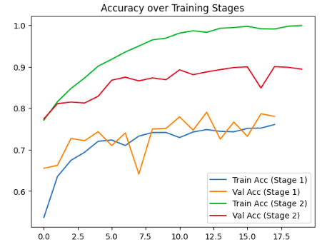
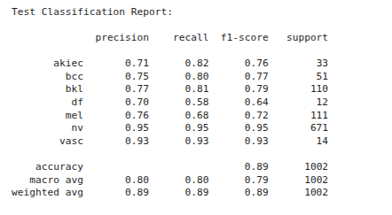
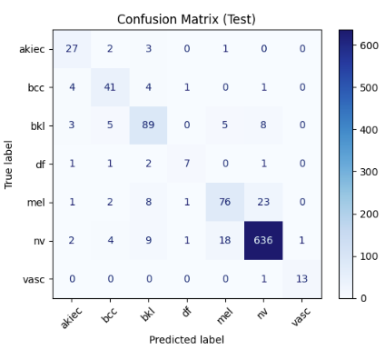
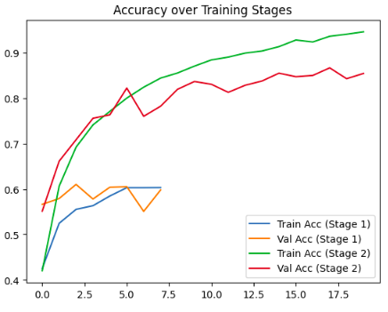
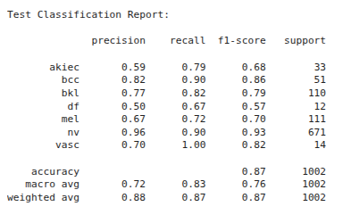
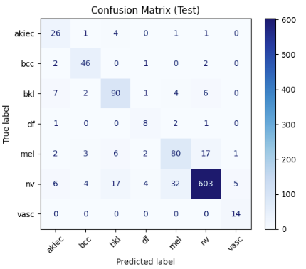
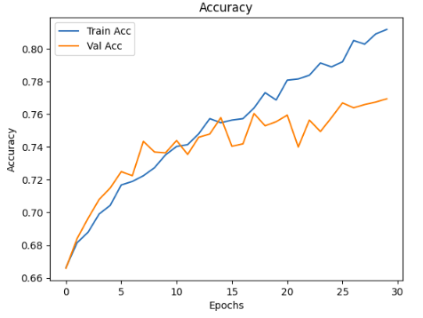
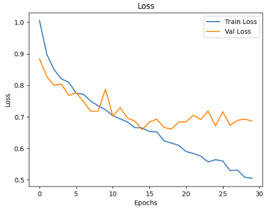
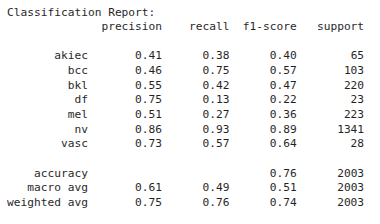

# Knowledge Distillation for Skin Classification 

I am experimenting with **Knowledge Distillation (KD)** to improve skin lesion classification.  
So far, I have tried the following models:

- ✅ ConvNeXt-L  
- ✅ EfficientNetV2-L  
- ✅ Vanilla CNN  

---

## 📊 Results

Here are the results for the models I tried :

### ConvNeXt-L
  

### EfficientNetV2-L
  

### Vanilla CNN
  

---

## 🔜 Next Steps
- Finalize the **parent (teacher) model** for KD.  
- Try out different **student models** to find the one that performs best.  
- Add more experiments with balanced accuracy and F1-score.  
- Optimize for deployment in resource-constrained settings.  
